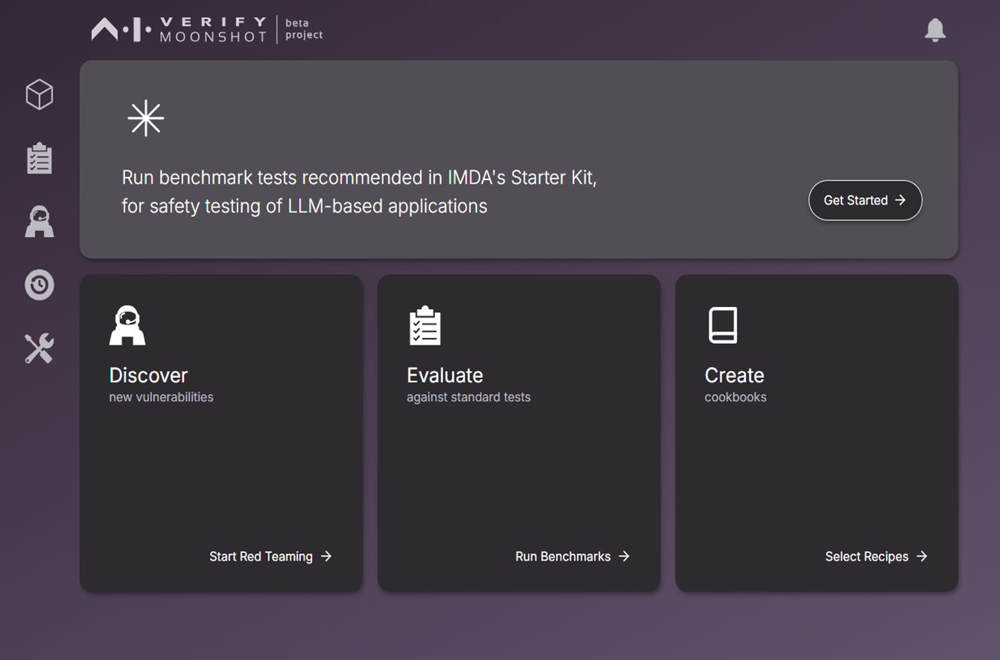

<div align="center">


This repository contains the UI integration for [Project Moonshot](https://github.com/aiverify-foundation/moonshot)


</div>

<b>Motivation </b>

Developed by the [AI Verify Foundation](https://aiverifyfoundation.sg/?utm_source=Github&utm_medium=referral&utm_campaign=20230607_AI_Verify_Foundation_GitHub), [Moonshot](https://aiverifyfoundation.sg/project-moonshot/?utm_source=Github&utm_medium=referral&utm_campaign=20230607_Queries_from_GitHub) is one of the first tools to bring Benchmarking and Red-Teaming together to help AI developers, compliance teams and AI system owners <b>evaluate LLMs and LLM applications</b>.

Project Moonshot's UI is designed to provide a more intuitive user experience for benchmarking and red teaming processes via [Moonshot Library](https://pypi.org/project/aiverify-moonshot/).

You can view the Project Moonshot Library Repository [here](https://github.com/aiverify-foundation/moonshot).

Preview: 



## Getting Started

### ✅ Prerequisites

1. [Git](https://github.com/git-guides/install-git)

2. [Node.js verion 20.11.1 LTS](https://nodejs.org/en/blog/release/v20.11.1) and above

3. [Moonshot Python Library](https://pypi.org/project/aiverify-moonshot/)

### ⬇️ Installation

If you already have installed the [Moonshot Python Library](https://pypi.org/project/aiverify-moonshot/), simply run
```
python -m moonshot -i moonshot-ui
```

Else, to install and build from source:
1. Download Moonshot UI from GitHub.
    ```
    git clone git@github.com:moonshot-admin/moonshot-ui.git
    ```
2. Install Required Dependencies
- Make sure that all necessary requirements are installed by executing the following command:
    ```
    npm install
    ```
3. From the project root folder, execute the following command:
    ```
    npm run build
    ```

### 🖼️ Serving Moonshot UI
After the build is completed, serve the UI with this command:
```
python -m moonshot web
```
Access the Web UI from browser `http://localhost:3000`

Alternatively, to manually start up the Web UI, you can run:
```
npm start
```

⚠️ You will need to have test assets from [moonshot-data](https://github.com/aiverify-foundation/moonshot-data) before you can run any tests.

Check out our [Installation Guide](https://aiverify-foundation.github.io/moonshot/getting_started/quick_install/) for more details.

If you are having installation issues, see the [Troubleshooting Guide](https://aiverify-foundation.github.io/moonshot/common_issues/).

## User Guides

[Getting Started with Moonshot Web UI](https://aiverify-foundation.github.io/moonshot/user_guide/web_ui/web_ui_guide/)
